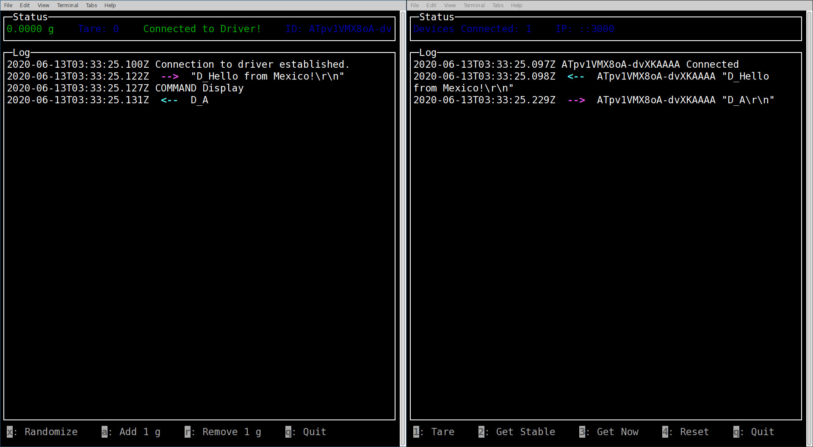
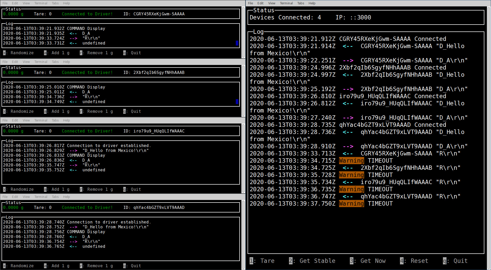

# Node - Take Home Challenge

Simulate the asyncronous communication between a hardware device and a driver.

### Simulated Mettler Toledo Scale (left) and Driver (right)



### 4 Simulated Mettler Toledo Scales (left) and Driver (right)



## Scope

The following points were achieved:

- Used Javascript ES6
- Configured environment to use ESLint + Prettier + AirBnB Config
- 100% Asynchronous communication using Socket.IO and Promises
- Handle multiple devices at the same time. I only tested 8 devices simultaneously.
- CLI on both ends (hardware and driver)
  - CLI on the hardware side allows to send commands to ALL connected devices sequentially.
  - CLI on the hardware side displays the current state of the scale and allows the user to modify the current weight on the scale (just as in real life).
- Instead of having a preprogrammed routing, the user can manually send commands to all devices.
- Simulated real-life delays on communication.
- Modeled as close as possible the working principle of the Mettler Toledo Analytical Scale.

Missing:

- Unit Testing

## Device Simulation

This project simulates the communication with a Mettler Toledo Analytical Scale using a limited command set. The key feature of the implementation is that whenever the weight changes it takes some time to stabilize the value, just as in real life. For debugging purposes this time is fixed at 5000 ms.

Moreover, all commands have a random response time between 0 - 500 ms. This is to simulate real case scenarios.

Available Commands:

- `S` - Send Stable Weight Value
- `SI` - Send Weight Value Immediately
- `T` - Tare
- `D` - Display Message
- `R` - Reset command (_note: this command will **not** send a response on purpose. This will trigger a timeout on the driver._)

## Project Structure

### /

Base folder contains the configuration for ESLint and Vscode. Usually this would be in each project but for simplicity it is on a top-level folder. **Executing here `npm install` will only install eslint.**

### /driver/

Contains the driver that controls multiple devices. Runs on port 3000.

To install modules, _cd_ here and:

```
npm install -y
```

To run:

```
npm run start
```

### /hardware/

Contains the fake hardware implementation. Multiple instances of this project can be executed simultaneously.

To install modules, _cd_ here and:

```
npm install -y
```

To run:

```
npm run start
```

### Notes on Folder Structure

`/driver/src/Cli.js` and `/hardware/src/Cli.js` are the same file. Usually this would be linked either as a module with `npm link` or a symbolic link in linux. For compatibility reasons it was just copied on both folders.

## Requirements

This code was executed under the following conditions:

- Node.js v14.2.0
- Linux environment (CLI is not tested in Windows or OSX)

## Known Bugs

- Since a curses library (`blessed`) is used for the cli, any errors that occur and terminate the application are lost inside of the curses screen.
- Sometimes the curses library does not resize boxes correctly.
- A race condition might happen on the driver side when a timeout is issued and immediatly a new command is called. If the response of the timed out command is still received, it will be assigned as a response to the new command. This is documented in `driver/src/ClientHandler.js`

_Having more time I would solve this issues :)_

## License

This project is licensed under the MIT License - see the LICENSE file for details.
